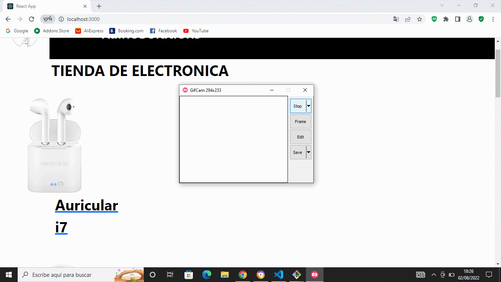

# Entrega Final React - Raices

## Tienda De Eletronica

## RainoSolutions

A continuacion detallare el paso a paso de mi proyecto de Ecommerce en la plataforma React JS.

El paso a paso y las distintas herramientas que utilice.

- ## 1- Crear proyecto de react y subirlo a github.

> **En este primer paso, instale React JS con su apariencia basica. Usando los git y los comandos git add, git commit y git push subi mi repositorio a Github**

.jpg>)

- ## 2- Crear componente NavBar y organizar archivos correspondientes

> **Aqui le emepece a dar forma al proyecto, utlizando la carpeta components para empezar a alojar los distintos items de mi Ecommerce**

> **Tuve algunos problemas ya que en vez de usar como NavBar use el archivo como Header.js, luego pude solucionarlo.**

- ## 3- Crear componente CartWidget y utilizar icono para el carrito de compras.

> **Dentro de CartWidget aplique la herramienta bootstrap para el icono del mi carrito y utilice las etiquetas para poder moverme entre los distintos filtros de mi barra de navegacion, tal cual se ve en la imagen anterior, esta parte no me ocasiono mayor problema**

- ## 4- Crear contador con boton.

> **En este paso se creo el ItemCount, en el mismo se setea la cantidad de productos que luego seran ingresados al carro para la compra, entiendo como se utiliza el useState**

- ## 5- Mostrar productos con promise

> **Aqui emepece a mostrar los productos de mi Ecommerce simunlando que la traia de una base de datos, creando el componente item y el itemListContainer quien el que contiene toda la logica, la idea no era mostrar el producto sino setearlo, creando la nueva promesa**

- ## 6- Detalle del producto

> **Similar al paso anterior, pero ahora seteando el detalle del producto, creando el componente itemDetail, aun simulando que traemos ese producto de una base de datos**

- ## 7- Realizar el routing de mi Ecommerce

> **Aqui se creo la ruta para poder ir a las distintas categorias dentro del Ecommerse, crear las rutas y con los enlaces nos lleven a esas rutas que creamos, para eso instalar el React Router DOM, y mostrar todos los detalles que requiera. Creando el ambito donde se va a poder utilizar**

- ## 8- Sincronizacion del Counter

> **El contador tenia que encontrarse en cada detalle de cada producto para que luego nos aparezcae el boton de terminar compra utilizando la etiqueta Link y nos lleve al Cart**

- ## 9- Cart View

> **Luego de usar la tecnica de renderizado, en caso de no tener productos en el Cart se renderiza un texto que te lleva a que realices las compras, tambien en el CartWidget la cantidad de productos que compraste**

- ## 10- Incoporando Firebase

> **Este fue quizas el paso mas tedioso, ya que luego no me tomaba los productos de la base de datos ya que no lograba comunicarme con el FireStore, basicamente abri el usuario estableci cada documento con sus distintas categorias, previo a esto obviamente instale Firebase con el npm install junto con todos sus componentes para luego crear la logica del mismo**

- ## 11- Cargando una OC con FireStore

> **Finalmente tomar cualquier producto, cargarlos en el carrito para luego emitir una OC que se reflejara en un documento establcido llamado Order que por medio de un link podremos visuzalizar en la base de datos**

- ## 12- Gif del proceso de mi Ecommese

